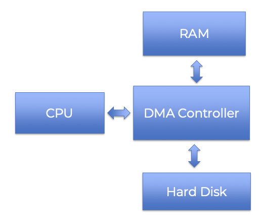
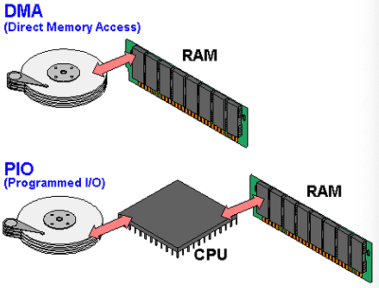

Direct memory access (DMA) is a feature of computer systems that allows some hardware devices (either internal or external) to communicate directly with another computer system's RAM memory and transfer data from it without processing it using the CPU.

