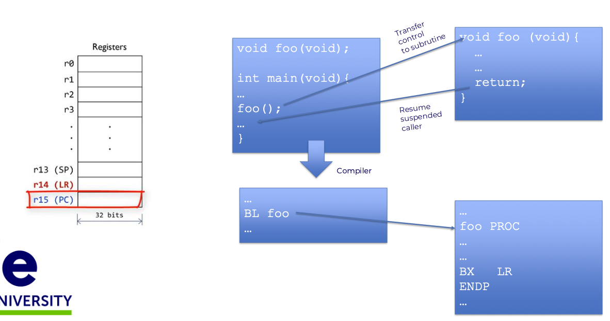

Program Counter (PC) and Link Register (LR)
- PC holds the address of the instruction being fetched from memory.
- LR holds the return address when a subroutine is called (where to go back after subroutine finishes)