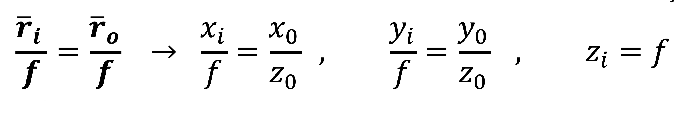

Simplest camera (basically just a small hole in a wall).

Pinhole cameras perform [perspective projection](https://grokipedia.com/page/3D_projection#perspective-projection).

Each point in the scene gets mapped to one single point in the image.

The size of the object in the image plane depends on the **focal length** and the **distance of the object to the pinhole**.

Using similar triangles, and with the image plane located at

A 3D straight line is also a straight line in the 2D image plane because the intersection of two planes (image plane and the plane formed by the straight line and the pinhole) is a straight line.

## Pinhole Size
In theory, the pinhole size sould be as small as possible because we want each point in the object be uniquely mapped to a single point in the image.
If the pinhole is too large, several rays of light for a point get through and the image gets blurry.

However, if the hole is too small, it will result in **diffraction** where the image also gets blurry.

The ideal pinhole diameter is:

This expression leverages the geometric blur caused by large diameters (proportional to d) with the blur caused by diffraction (proportional to $f\lambda/d$). $\lambda$ for visible light is roughly 550nm.