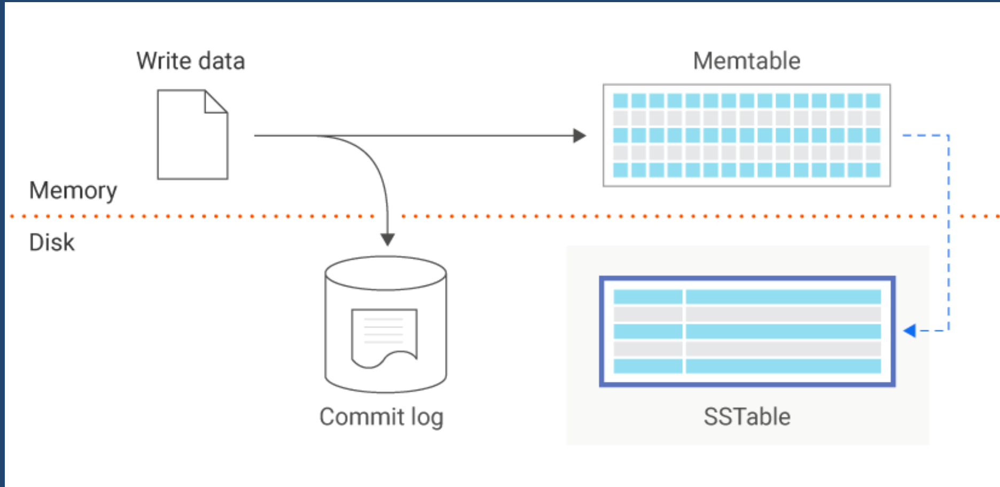

SSTables, or Sorted String Tables, are a data structure used in NoSQL databases like Apache [Cassandra](/designing-and-using-databases/cassandra) and LevelDB. They are optimized for efficient storage and retrieval of large datasets.

## Structure
- SSTables are organized as a series of sorted key-value pairs.
- Keys are stored in sorted order, enabling efficient range queries.

## How it Works
- Data is sequentially written to SSTables in immutable files.
- SSTables are periodically compacted to merge and remove redundant data.
- Bloom filters may be used to quickly identify whether a key exists in an SSTable.

## Benefits and Challenges
### Benefits
- Efficient Range Queries
	- Sorted keys allow for efficient range queries and point lookups.
- Write Optimization
	- Append-only nature of SSTables simplifies write operations and supports high write throughput.
- Compression
	- SSTables often incorporate compression techniques, reducing storage space.

### Challenges 
- Read Overhead
	- Random reads can result in multiple SSTables needing to be scanned.
- Compaction
	- Periodic compaction is required to clean up obsolete data, which can be resource-intensive.
