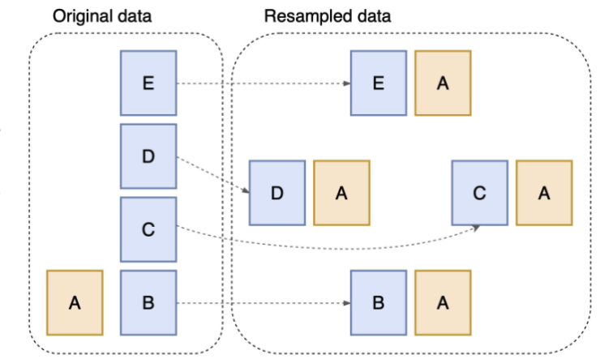

- Randomly chunk majority examples into H subsets and create H training sets.
- After training H models, we make predictions by averaging (or taking the majority) of the outputs of H models.

Figure: H=4
- Imbalanced binary learning problem
- Chunk the examples of the majority class into four subsets.
- Copy four times all the examples of the minority class.
- Simple and scalable approach.
- We can train and run our models in parallel on different GPU.
- Ensemble tends to produce a better prediction than the individual