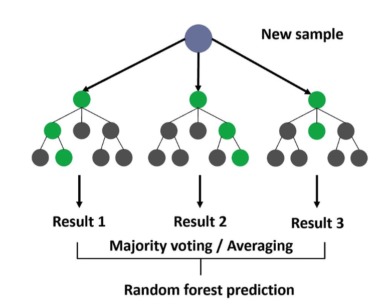

Random Forest is an [ensemble](/machine-learning-foundations/algorithms/ensemble-methods) learning method that combines multiple [Decision Tree](/machine-learning-foundations/algorithms/decision-tree)s to improve [predictive](/machine-learning-foundations/predictive-power) [Accuracy](/machine-learning-foundations/evaluation-metrics/accuracy) and reduce overfitting (combine weak learners). It is one of the most popular and powerful machine learning algorithms, used for both #ml/classification and #ml/regression tasks. The key idea behind random forests is to introduce randomness into the tree-building process to create diverse trees, which are then combined to make more robust predictions.

## How it works
1. **Ensemble Learning:**
   - Random forest is a type of **[Bagging](/machine-learning-foundations/algorithms/bagging) (Bootstrap Sampling)** algorithm.
   - It builds multiple decision trees independently and combines their predictions (e.g., by majority voting for classification or averaging for regression).
2. **Training Process:**
   - **Step 1: Bootstrap Sampling:**
     - Randomly sample the training data with replacement (bootstrapping) to create multiple subsets. Each subset is used to train a separate decision tree.
   - **Step 2: Feature Randomness:**
     - At each split in a decision tree, instead of considering all features, a random subset of features is selected. This introduces diversity among the trees.
   - **Step 3: Tree Construction:**
     - Each tree is grown to its maximum depth without pruning, ensuring low bias.
   - **Step 4: Aggregation:**
     - For **classification**: The final prediction is the majority vote of all trees.
     - For **regression**: The final prediction is the average of all trees' predictions.
   - **Step 5: Out-of-Bag (OOB) Error:**
	   - Uses data points not included in a tree’s bootstrap sample to internally evaluate the model's performance without requiring a separate validation dataset.

## Preconditions
- Requires tuning [Hyperparameter](/machine-learning-foundations/introduction/parameters-and-hyperparameters)s: number of trees, bagging, etc
## Evaluation
- [Accuracy](/machine-learning-foundations/evaluation-metrics/accuracy)
- [Mean Squared Error](/machine-learning-foundations/evaluation-metrics/mean-squared-error)
## Advantages
- Robust
- Reduces overfitting
## Limitations
- Computationally expensive