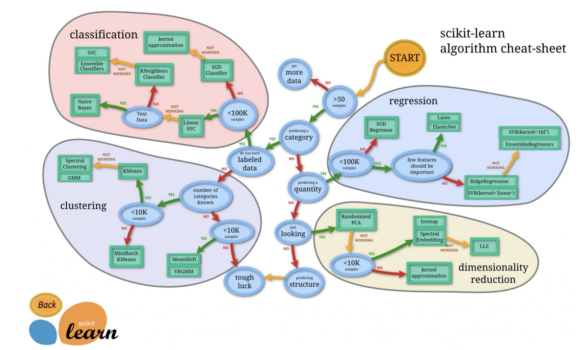

- **Explainability**: Do we need to understand/explain how/why an algorithm made a prediction? Opaque: DNN, ensemble models; Transparent: [kNN](/machine-learning-foundations/algorithms/k-nearest-neighbors)], [Linear Regression](/machine-learning-foundations/algorithms/linear-regression), [Decision Tree](/machine-learning-foundations/algorithms/decision-tree) learning.
- **In-memory vs. out-of-memory**: Can we load all the dataset in the RAM? If not, incremental learning algorithms, i.e., [Naive Bayes](/machine-learning-foundations/algorithms/naive-bayes) and [Neural Network](/machine-learning-foundations/deep-learning/neural-networks) (NN) training algorithms.
- **Number of records and features**: What is the maximum dataset/feature size/number managed by the algorithm? E.g., [SVM](/machine-learning-foundations/algorithms/support-vector-machines) modest size/number; [Neural Network](/machine-learning-foundations/deep-learning/neural-networks) and [Random Forest](/machine-learning-foundations/algorithms/random-forest)s millions.
- **Nonlinearity of the data**: Are data linearly separable? Yes: SVM + linear kernel, linear and logistic regression; No: DNN or ensembles. Training speed: How much time do we have for (re)training the algorithm? Consider retraining time (e.g., every hour), opportunities for parallelism (e.g., random tree forests), GPUs (e.g., NN)
- **Prediction speed**: How fast does a prediction/inference need to be? Consider throughput requirements. Shallow is faster than deeper algorithms (e.g., DNN, KNN, ensemble).

## Shortlisting Algorithms Candidates (Spot Checking)
1. Select algorithms based on different principles (sometimes called orthogonal), such as instance-based algorithms, kernel-based, shallow learning, deep learning, or ensembles.
2. Try each algorithm with 3-5 different values of the most sensitive hyperparameters, e.g., the number of neighbors k in [kNN](/machine-learning-foundations/algorithms/k-nearest-neighbors), penalty C in [SVM](/machine-learning-foundations/algorithms/support-vector-machines), or decision threshold in [Logistic Regression](/machine-learning-foundations/algorithms/logistic-regression)).
3. Use the same training/validation split for all experiments.
4. If the learning algorithm is not deterministic (e.g., NN and [Random Forest](/machine-learning-foundations/algorithms/random-forest)s), run several experiments and then average the results.
5. Once the project is over, note which algorithms performed the best. Use this information when working on a similar problem in the future.