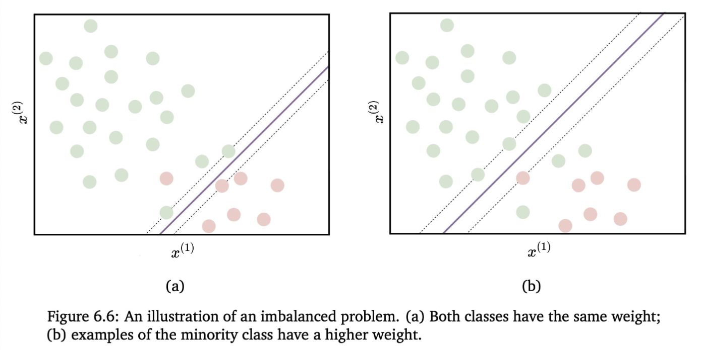

- [SVM](/machine-learning-foundations/algorithms/support-vector-machines), [Decision Tree](/machine-learning-foundations/algorithms/decision-tree), [Random Forest](/machine-learning-foundations/algorithms/random-forest)
- For each class, we provide a weight and multiply the cost function by that weight.
- e.g. use a greater weight for a minority class to keep it relevant during training.

### Using this technique with SVM
- Problem: distinguish between genuine and fraudulent e-commerce transactions.
- SVM moves the hyperplane to reduce the number of misclassified examples
- The examples of genuine transactions are much more frequent.
- If the misclassification cost is the same for both classes, the "fraudulent" examples, in the minority, risk being misclassified to allow classifying more of the majority class correctly.
- Solution: we use SVM with soft margin, defining a cost for misclassified examples.
