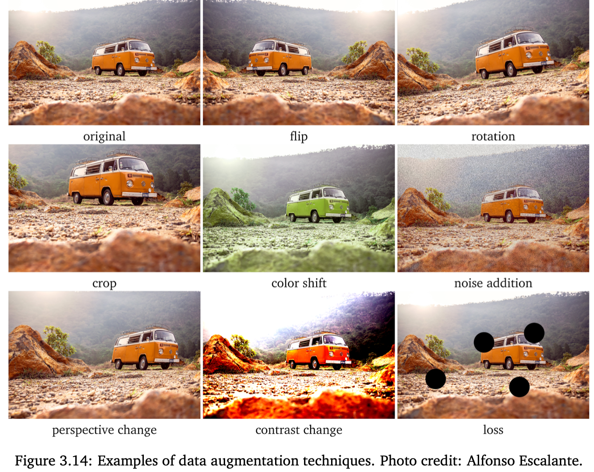

For some type of data, it's quite easy to get more labeled examples without additional labeling. The strategy is called **data augmentation**, and it's most effective when applied to **images**. It consists of applying simple operations, such as crop or flip, to the original images to obtain new images.

# Data Augmentation for Images
**Flipping** has to be done only with respect for which the meaning of the image is preserved.

**Rotation** should be applied with slight angles to simulate an incorrect horizon calibration. Can be done in both directions.

**Crops** can be randomly applied multiple times to the same image by keeping a significant part of the object(s) of interest in the cropped images.

In **color shift**, nuances of RGB are slightly changed to simulate different lighting conditions. Contrast change (both decreasing and increasing) and **Gaussian noise** of different intensity can also be applied multiple times to the same image.

By randomly removing parts of an image, we can simulate situations when an object is recognizable but not entirely visible because of an obstacle.

**Mixup** consists of training the model on a mix of the images from the training set. Instead of training the model on the raw images, we take two images (that could be of the same class or not) and use for training their linear combination:

$$
\text{mixup\_image} = t \times \text{image}_1 + (1 - t) \times \text{image}_2,
$$

where $t$ is a real number between 0 and 1. The target of that mixup image is a combination of the original targets obtained using the same value of $t$:

$$
\text{mixup\_target} = t \times \text{target}_1 + (1 - t) \times \text{target}_2.
$$
Experiments showed that mixup improves the generalization of [Neural Network](/machine-learning-foundations/deep-learning/neural-networks) models. The authors of mixup found that it increases the robustness to **adversarial examples** and stabilizes the training of **generative adversarial networks** (GANs).

If compressed images are expected in production, they should also be simulated. 

Only used on-the-fly for training.

# Data Augmentation for Text

For text data augmentations, we need to use appropriate transformation techniques to preserve the contextual and grammatical structure of natural language texts.

## Replacing random words in a sentence with their close synonyms
For the sentence, "The car stopped near a shopping mall", some equivalent sentences are:
- "The automobile stopped neear a shopping mall".
- "The car stopped near a shopping center"
- "The auto stopped near a mall".
## Replacing random words in a sentence with their close hypernyms
A hypernym is a word that has more general meaning. e.g. "mammal" is a hypernym for "whale" and "cat"; "vehicle" is a hypernym for "car" and "bus".

## Gaussian Noise to Random Embeddings
If you represent words or documents in your dataset using **word** or **document embeddings**, you can apply slight Gaussian noise to randomly chosen embedding features to make a variation of the same word or document. You can tune the number of features to modify and the noise intensity as [Hyperparameter](/machine-learning-foundations/introduction/parameters-and-hyperparameters)s by optimizing the performance on [validation data](/machine-learning-foundations/data/training-and-holdout-datasets).
## Replace a word in the sentence with k-nearest neighbor
Alternatively, to replace a given word w in the sentence, you can find [k-Nearest Neighbors](/machine-learning-foundations/algorithms/k-nearest-neighbors) to the word in the word embedding space and generate knew sentences by replacing the word with its respective neighbor. The nearest neighbors can be found using a measure such as [[cosine similarity]] or [[Minkowski Distances|Euclidean distance]]. The choice of the measure and the value of k, can be tuned as a [Hyperparameter](/machine-learning-foundations/introduction/parameters-and-hyperparameters).
## Use BERT to generate synonym for data augmentation
A modern alternative to the k-nearest neighbors approach described above is to use a deep pre-trained model such as Bidirectional Encoder Representations from Transformers (BERT). Models like BERT are trained to predict a masked word given other words in a sentence. One can use BERT to generate k most likely predictions for a masked word and then use them as synonyms for data augmentation.

You can use similar technique to classify unlabeled documents based on similar labeled documents based on similarity.
## Back Translation
Another useful text data augmentation technique is back translation. To create a new example from a text written in English (it can be a sentence or a document), first translate it into another language lusing a machine translation system. Then translate it back from l into English. If the text obtained through back translation is different from the original text, you add it to the dataset by assigning the same label as the original text.

# Data Augmentation for Audio and Video
- addition of noise
- shifting an audio or video clip in time
- slowing down / accelerating
- changing pitch for audio & color balance for video