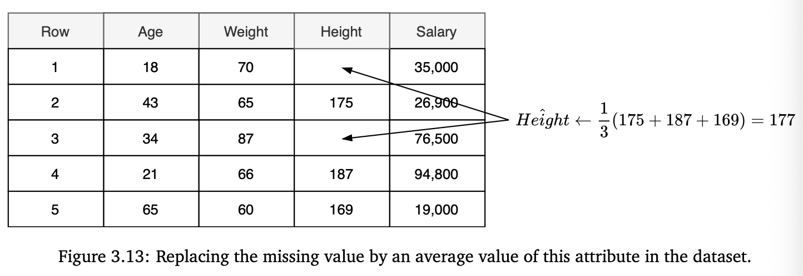

Techniques used to fill in missing values in datasets.
## Replacing with Average Value
One technique consists in replacing the missing value(s) by the average value of this attribute in the rest of the dataset.

$$
\hat{x}^{(j)} \leftarrow \frac{1}{N(j)} \sum_{i \in S(j)} x_i^{(j)},
$$

## Replacing with Value Outside the Normal Range
For example, if the regular range is [0,1], you can set the missing value to 2 or -1.

If the attribute is categorical, such as days of the week, then a missing value can be replaced by the value "Unknown".

## Middle of the Range
If the attribute is numerical, another technique is replacing the missing value with a value in the middle of the range.

For example, if the range for an attribute is [-1,1], you can set the missing value to be equal to 0. 

Here, the idea is that the value in the middle of the range will not significantly affect the prediction.

## Use missing value as the target for regression
A more advanced technique is to use the missing value as the target variable for a regression problem. (In this case, we assume all attributes are numerical.) You can use the remaining attributes $[x_i^{(1)}, x_i^{(2)}, \ldots, x_i^{(j-1)}, x_i^{(j+1)}, \ldots, x_i^{(D)}]$ to form a feature vector $\hat{x}_i$, set $\hat{y}_i \leftarrow x_i^{(j)}$, where $j$ is the attribute with a missing value. Then you build a regression model to predict $\hat{y}$ from $\hat{x}$. Of course, to build training examples $(\hat{x}, \hat{y})$, you only use those examples from the original dataset, in which the value of attribute $j$ is present.

## Adding a Synthetic Binary Indicator Attribute
If you have a significantly large dataset and just a few attributes with missing values, you can add synthetic binary indicator attribute.

e.g. if examples in your dataset are D-dimensional, and the attribute at position j=12 has missing values, you can add  the attribute j=D+1 which is 1 if attribute j exists and 0 if not, for each example. Then replace the missing value with 0 or any value of choice.

# [Leakage](/machine-learning-foundations/data/data-leakage) During Imputation
If you use the imputation techniques that compute some statistic of one attribute, the leakage happens if you use the whole dataset to compute this statistic.

Not as significant as other leakage. You have to partition first, then do imputation on[training set](/machine-learning-foundations/data/training-and-holdout-datasets).