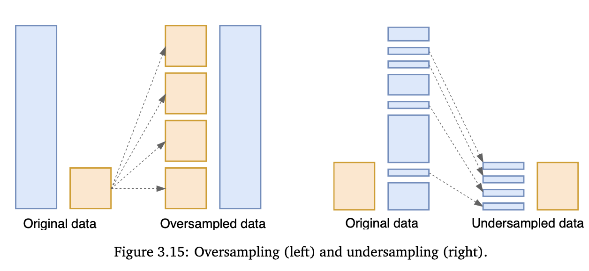
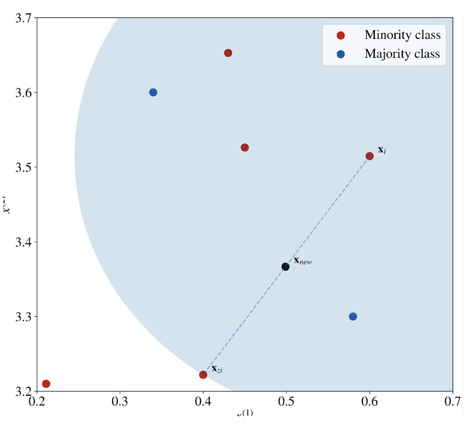

A technique used frequently to mitigate [Imbalanced Data](/machine-learning-foundations/data/imbalanced-data).

By making multiple copies  of minority class examples, it increases their weight.

You might also create synthetic examples by sampling feature values of several examples of the minority class and combining them to obtain a new example of that class.

Two popular algorithms for synthetic examples are:
- [Synthetic Minority Oversampling Technique (SMOTE)](/machine-learning-foundations/data/synthetic-minority-oversampling-technique-smote)
- [Adaptive Synthetic Sampling Method (ADASYN)](/machine-learning-foundations/data/adaptive-synthetic-sampling-method-adasyn)

SMOTE and ADASYN work similarly in many ways. For a given example $\mathbf{x}_i$ of the minority class, they pick $k$ nearest neighbors. Let’s denote this set of $k$ examples as $S_k$. The synthetic example $\mathbf{x}_{\text{new}}$ is defined as $\mathbf{x}_i + \lambda(\mathbf{x}_{z_i} - \mathbf{x}_i)$, where $\mathbf{x}_{z_i}$ is an example of the minority class chosen randomly from $S_k$. The interpolation hyperparameter $\lambda$ is an arbitrary number in the range $[0, 1]$. (See an illustration for $\lambda = 0.5$ in Figure 3.16.)

Both SMOTE and ADASYN randomly pick among all possible $\mathbf{x}_i$ in the dataset. In ADASYN, the number of synthetic examples generated for each $\mathbf{x}_i$ is proportional to the number of examples in $S_k$, which are not from the minority class. Therefore, more synthetic examples are generated in the area where the minority class examples are rare.
