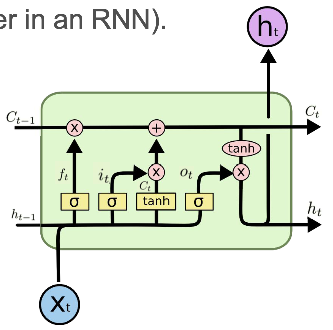
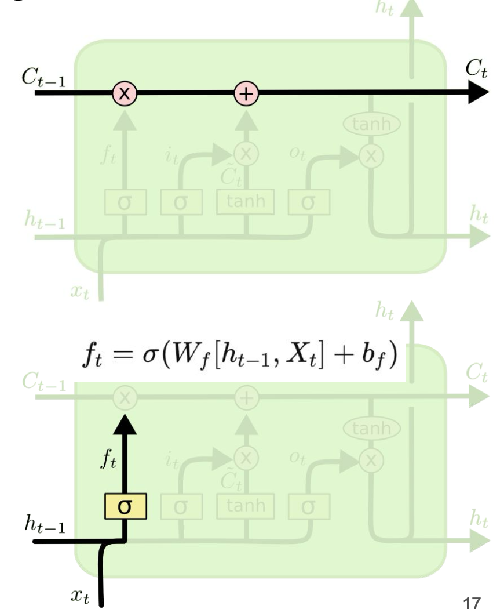
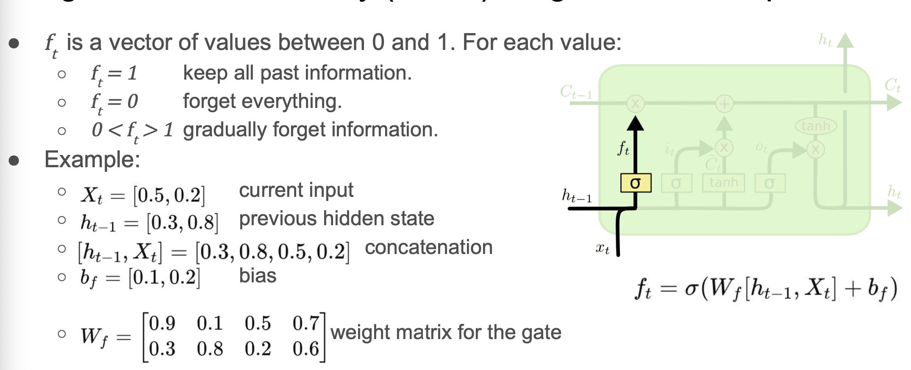
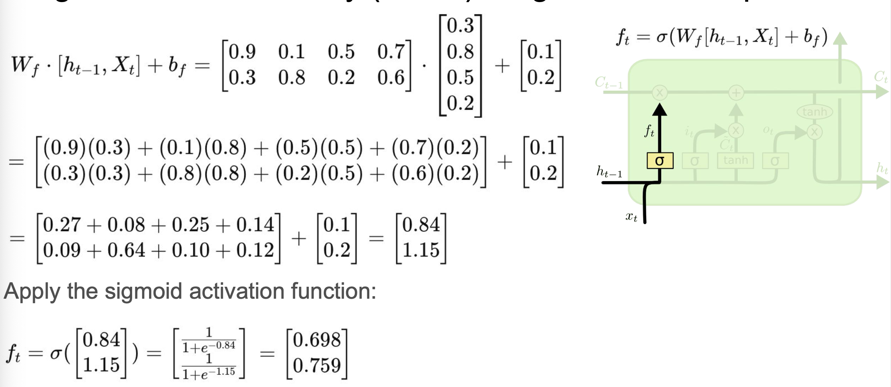
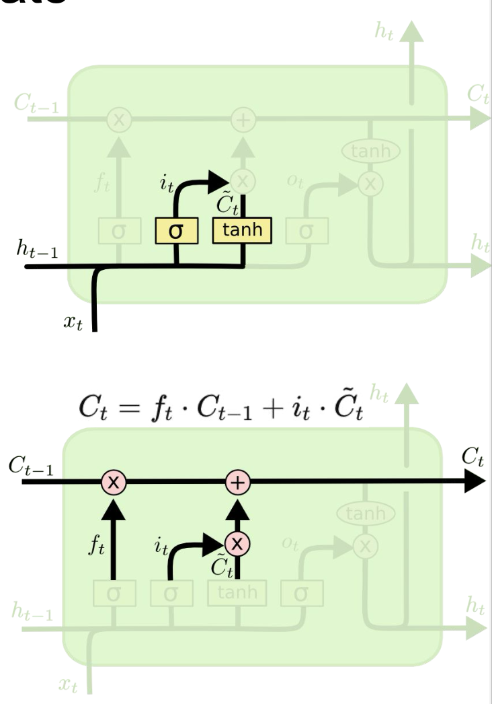
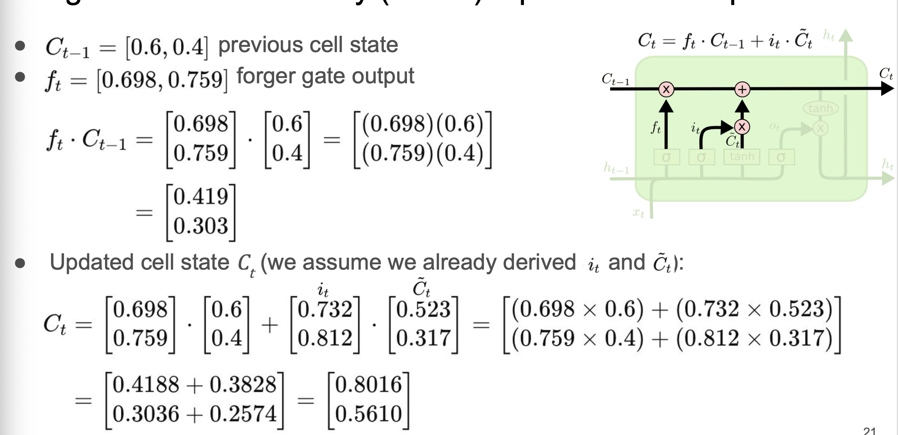
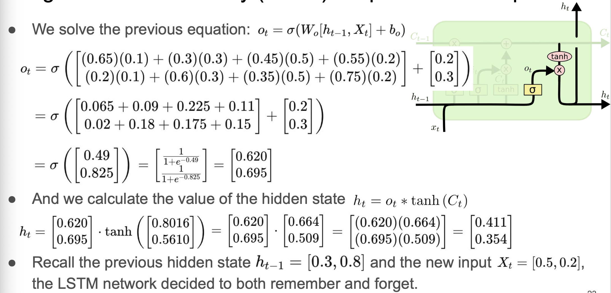

[Recurrent Neural Networks](/machine-learning-foundations/deep-learning/recurrent-neural-networks) designed to remember long-term dependencies using memory cells and gating mechanisms.
- **Use**: time-series forecasting, text generation, stock prediction, speech recognition.
- **Data flow**: data flows through memory cells with forget, input, and output gates controlling information retention.
- **Structure**: Input Layer → LSTM units (memory cells with gates) → Output Layer
- **Activation Function**: Tanh/ReLU for memory cells, Sigmoid for gates, Softmax for classification.
- **Loss Function**: cross-entropy loss for classification, MSE for regression
- **Learning**: [Gradient Descent](/machine-learning-foundations/deep-learning/gradient-descent) and BPTT
- **Pros**
	- solves vanishing gradient problem
	- good at capturing long-term dependencies
- **Cons**
	- slower training
	- computationally expensive
	- requires more memory

## Architecture
- RNNs have memory, but it's limited due to the intrinsic constraints of the hidden state size and backpropagation through time (BPTT)
- RNNs can make predictions based on the near past but fail when these predictions depend on data that is relatively distant from the past.
- LSTMs are a special kind of RNN, capable of learning long-term dependencies using a cell with four layers (instead of the single layer in an RNN)
- Layers consist of gates and pointwise operations
	- Forget gate $f(t)$
	- Input gate $i_t$
	- Update cell state $C_t$
	- Output gate $O_t$
		
## Forget Gate
- Cell State
	- the horizontal line running through the top of the diagram.
- Gate
	- Gates control adding/removing information to/from the cell state.
	- Sigmoid neural net layer + pointwise multiplication. Outputs number between zero and one; 0 = close gate; 1 = open gate.
- Forget Gate Layer
	- decides how much of the past $C_{t-1}$ state should be discarded.
	-  Current input at time $t$
	-   $X_t$: current input at time $t$
	-   $h_{t-1}$: previous hidden state
	-   $W_f$: forget gate weight matrix
	-   $b_f$: forget gate bias
	-   $\sigma$: sigmoid activation function
	

### Forget Gate Example

Forget gate outputs values close to 1 thus most of the previous memory will be kept.

## Input Gate
- New information we're going to store in the cell state.
- Input gate
	- decides which values we'll update
	- $i_t = \sigma \left( W_i \cdot [h_{t-1}, x_t] + b_i \right)$
- Tanh layer
	- creates a vector of new candidate values $\tilde{C}_t$, that could be added to the cell state.
	- $\tilde{C}_t = \tanh \left( W_C \cdot [h_{t-1}, x_t] + b_C \right)$
- Update the old cell state
	- We multiply the old state by $f_t$, forgetting the amount of details computed by the forget gate.
	- We add $i_t \cdot \tilde{C}_t$, i.e. the new candidate values, scaled by how much we decided to update each state value.
	

 ### Input Gate Example
 

## Output Gate
-   Final step: compute the hidden state $h_t$.
-   Output is based on filtering our cell state:
   - Sigmoid layer: decides what cell state is outputted $o_t = \sigma(W_o [h_{t-1}, X_t] + b_o)$
   - Tanh activation function: push cell state between -1/1
   - Multiply the output by activated cell state to output only the chosen part of the cell state.
   - $h_t = o_t \ast \tanh(C_t)$
-   Example, substituting the previous values we get:

$$
o_t = \sigma \left(
\begin{bmatrix}
0.65 & 0.3 & 0.45 & 0.55 \\
0.2 & 0.6 & 0.35 & 0.75
\end{bmatrix}
\cdot
\begin{bmatrix}
0.1 \\
0.3 \\
0.5 \\
0.2
\end{bmatrix}
+
\begin{bmatrix}
0.2 \\
0.3
\end{bmatrix}
\right)
$$
## Output Gate Example
