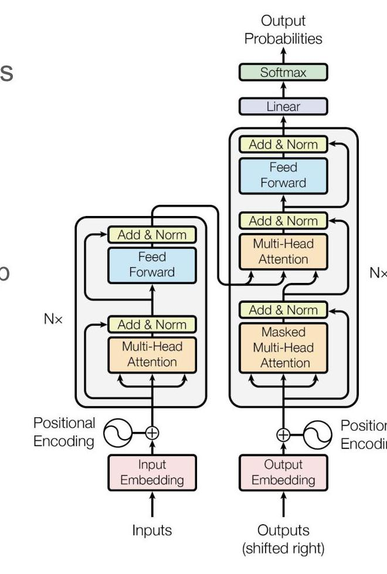
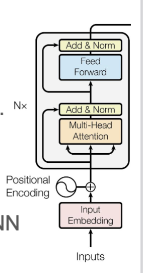
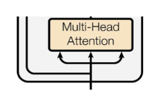
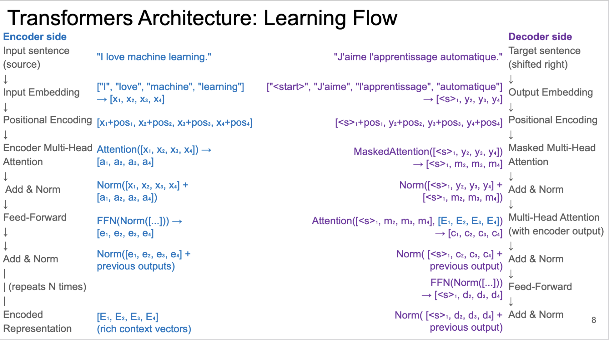
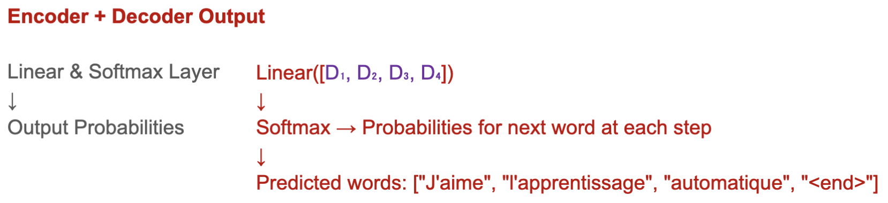
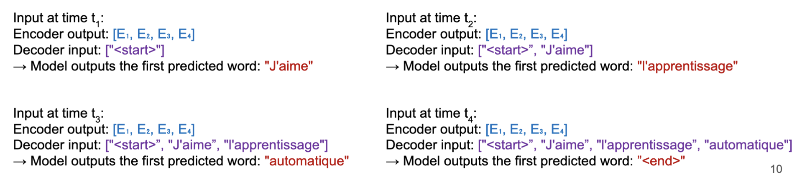

Parallelized [Neural Network](/machine-learning-foundations/deep-learning/neural-networks) using **self-attention mechanism** instead of recurrence to process sequential data.

- **Use**
	- Natural Langage processing (NLP), speech recognition, machine translation, chatbots, large language models (e.g. GPT, BERT)
- **Data Flow**
	- Uses multi-head self-attention to capture relationships among tokens in parallel.
- **Structure**
	- Input Embedding → Multi-head self-attention layers → Feedforward layers → Output Layer.
- **Activation Function**
	- ReLU in hidden layers.
	- Softmax for classification tasks.
- **Loss Function**
	- [Cross-Entropy Loss](/machine-learning-foundations/evaluation-metrics/cross-entropy-loss) for classification.
	- MSE for regression.
- **Learning**
	- Uses transformer-based attention mechanisms, trained using Adam optimizer and large datasets.
- **Pros**
	- Highly scalable
	- Faster than [RNN](/machine-learning-foundations/deep-learning/recurrent-neural-networks)s and [LSTM](/machine-learning-foundations/deep-learning/long-short-term-memory)s, SOTA in NLP.
- **Cons**
	- Massive datasets
	- Computationally expensive
	- Hard to interpret

## Architecture
- Process features in parallel. E.g., sentence: processes words/n-grams in parallel, not sequentially.
- Processing all the features at the same time, enables learning relational patterns among them.
- Examples:
- Learn contextual use of words: "The needle has a sharp point." Vs "It is not polite to point at people."
- Learn references: "I went to France, after midterm, and there I ate the delicious food of that country"
- Architecture:
- Encoder (left); decoder (right).
- Self-attention computes relationships between words.
- Stacked layers (Nx times) build deep representations.
- Self-attention replaces recurrence.

## Encoder
- Left side: encoder processes the input sequence.
- Right side: decoder generates the output sequence.
- Encoder/decoder use multi-head self-attention + feedforward layers. N*
- Nx indicates a number N of identical concurrent layers.
- Input embedding: word embeddings contain semantic meaning but lack positional order.
- Positional encoding: add order information to embeddings. Note: RNN used recurrence.
- Multi-Head Self-Attention: each word attends to all other words in the sequence; one head per relation type
- Add & Norm: residual connection (Add) helps gradient flow; Layer normalization (Norm) stabilizes training.
- FFWN: concurrently applies transformations to words.

## Self-Attention
- Self-Attention: key mechanism that allows Transformers to process input sequences without recurrence.
- Instead of processing one word at a time (like RNNs),

Self-Attention lets each word attend to all other words.

- Each word is transformed into three vectors:
	- Query (Q): "What am I looking for?"
	- Key (K): "What do I have?"
	- Value (V): "What information do I pass forward?"
- Each word compares itself to every other word in the sequence.
- Words that are relevant to each other get higher attention scores.
- The model weighs the words based on these scores before making a decision.

- Input sequence:
	- E.g., "The cat sat on the mat".
	- Tokenized and embedded into a vector $X$ (as seen for RNNs).
- Each word in $X$ is multiplied by three weight matrices $\left(W_{Q}, W_{K^{\prime}}, W_{V}\right)$, creating three new matrices: $Q=X W_{Q}, K=X W_{K^{\prime}}, V=X W_{V}$
- Compute attention scores:
	- Use the scaled dot-product attention $\quad$ Attention $=$ softmax $\left(\frac{Q K^{T}}{\sqrt{d_{k}}}\right) V$
	- $Q K^{T}$ : Computes the similarity between each query and each key.
	- $\sqrt{d_{k}}$ : Scaling factor to prevent large values.
	- Softmax: converts scores into probabilities.
	- Multiplying by V: weighs the words based on their importance.
- Compute final attention output:
	- Words that are more relevant get a higher weight.
	- The attention mechanism highlights important words while downplaying irrelevant ones. E.g., given "cat", "sat" will be more important than "mat"
## Learning Flow

- Encoder encodes the input sentence, i.e., the sentence to translate
- Decoder decodes the input sentence using the target sentence (i.e., the actual translation) to train the neural networks.
- In the training phase, both the encoder and decoder process the input sentence (encoder) and the target sentence (decoder) simultaneously.
- Parallelism is offered by the multi-head attention (replacing the recursion in RNN)
- **Masking**: the first word of the decoder is the control word <start>. Without it the encoder would see the future, i.e., the word that it has to predict.

- The encoder gets the sentence as input; the decoder predicts one word at a time.
- At inference time, the encoder runs sequentially, and every step is based on previously predicted words and encoder context.
- Within each decoding step, computation (self-attention, encoder-decoder attention, FFN) remains parallel.
- However, sequential dependency across decoding steps prevents full parallelization across the entire output sequence.

