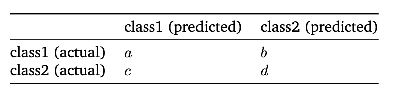

Applies to both **multiclass** and **imbalanced** problems.

Better than [Accuracy](/machine-learning-foundations/evaluation-metrics/accuracy) because it measures how much better a classification model performs compared to a classifier that randomly guesses a class according to the frequency of each class.
A measure of agreement between two raters or observers, taking into account the agreement that would be expected by chance. It is a widely used metric in various fields, including psychology, medicine, and social sciences.
## Definition and Interpretation
Cohen's Kappa statistic is defined as the ratio of the difference between the observed agreement and the expected agreement by chance, to the difference between 1 and the expected agreement by chance. The value of Kappa ranges from -1 to 1, where:
- A value of 1 indicates perfect agreement between the two raters.
- A value of 0 indicates that the agreement is no better than chance.
- A value of -1 indicates perfect disagreement between the two raters.
## Formula
The formula for Cohen's Kappa statistic is given by:
$$\kappa = \frac{p_o - p_e}{1 - p_e}$$
where:
- $p_o$ is the observed agreement between the two raters.
- $p_e$ is the expected agreement by chance.
## Components of the Formula
To calculate Cohen's Kappa statistic, we need to calculate the observed agreement ($p_o$) and the expected agreement by chance ($p_e$).

### Observed Agreement:
$$
p_o \overset{\text{def}}{=} \frac{a + d}{a + b + c + d}.
$$
### Expected Agreement obtained by $p_e \overset{\text{def}}{=} p_{\text{class1}} + p_{\text{class2}}$ where

$$
p_{\text{class1}} \overset{\text{def}}{=} \frac{a + b}{a + b + c + d} \times \frac{a + c}{a + b + c + d}
$$
and
$$
p_{\text{class2}} \overset{\text{def}}{=} \frac{c + d}{a + b + c + d} \times \frac{b + d}{a + b + c + d}
$$

## How we Use it in ML
1. Train the classification model
2. Make predictions on the [Validation Dataset](/machine-learning-foundations/data/training-and-holdout-datasets)
3. Compute a [Confusion Matrix](/machine-learning-foundations/evaluation-metrics/confusion-matrix)
4. Calculate Cohen's kappa based on predictions vs. ground truth (the labels representing the correct classification assigned to the data, against which we compare the model's predictions).
5. Interpret the kappa score to assess model reliability.
## Interpretation
No universal interpretation of the usable range of k values.
- 0.00–0.20: Slight Agreement
- 0.21–0.40: Fair Agreement
- 0.41–0.60: Moderate Agreement
- 0.61–0.80: Substantial Agreement
- 0.81–1.00: Almost Perfect Agreement
- < 0: Something is wrong, most likely a logical error
- > 1: Too good to be true!

