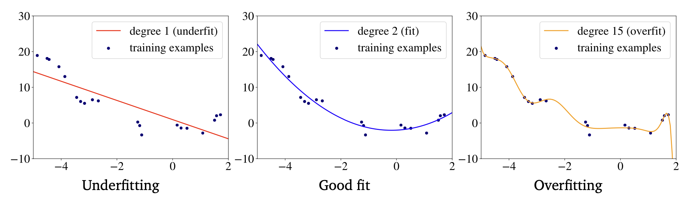

When a model predicts the training data labels very well, but works poorly on the [Holdout Dataset](/machine-learning-foundations/data/training-and-holdout-datasets).

Another name for overfitting is **high variance**: the model is unduly sensitive to small fluctuations in the training set.

If you sampled the training data differently, the result would be a significantly different model.

## Reasons
- The model is too complex for the data (e.g. very tall [Decision Tree](/machine-learning-foundations/algorithms/decision-tree) or a very deep [Neural Network](/machine-learning-foundations/deep-learning/neural-networks))
- There are too many features and few training examples
- You don't regularize enough.

## Possible Solutions
- Use a simpler model. Try linear instead of a polynomial regression, or [SVM](/machine-learning-foundations/algorithms/support-vector-machines) with a linear kernel instead of **radial basis function** (RBF), or a neural network with fewer layers/units.