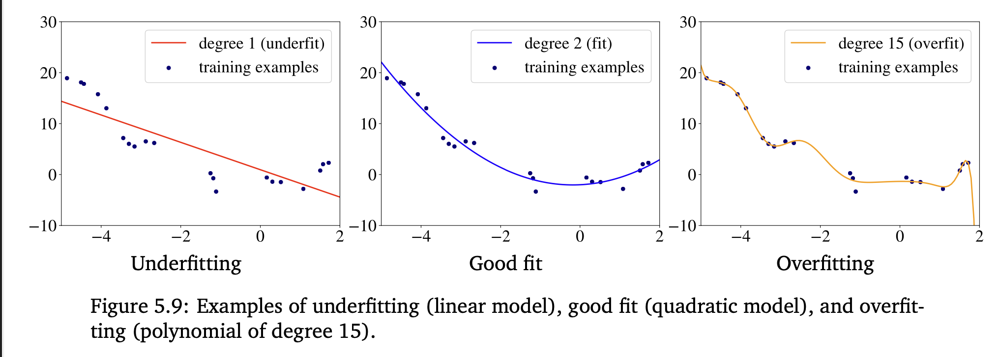

The model is said to have a **low bias** if it abely predicts the training data labels. If the model makes too many mistakes on the training data, we say that it has a **high bias**, or that the model **underfits** the data.

## Reasons
- The model is too simple for the data (e.g. linear models often underfit)
- The features aren't informative enough.
- You [regularize](/machine-learning-foundations/regularization/regularization) too much.

## Possible Solutions
- Trying a more complex model
- Engineering features with higher [Predictive Power](/machine-learning-foundations/predictive-power)
- Adding more training data when possible
- Reducing [Regularization](/machine-learning-foundations/regularization/regularization)
