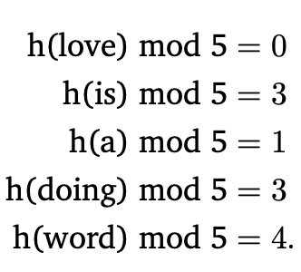

Feature hashing, or hashing trick, converts text data, or categorical attributes with many values, into a [Feature Vector](/machine-learning-foundations/feature-engineering/feature-vector) of arbitrary dimensionality.

[One-Hot Encoding](/machine-learning-foundations/feature-engineering/one-hot-encoding) and [Bag of Words](/machine-learning-foundations/feature-engineering/bag-of-words) create feature vectors of many dimensions that are sparse and computationally expensive.

To keep the data manageable, we can use the hashing trick that works as follows.

1. First, we decide on the desired dimensionality of our [Feature Vector](/machine-learning-foundations/feature-engineering/feature-vector)s. 
2. Then, using a **hash function**, we first convert all values of the categorical attribute (or all tokens in the collection of documents) into a number, and 
3. then we convert this number to an index of our [Feature Vector](/machine-learning-foundations/feature-engineering/feature-vector).

The problem with this technique is **collisions** will cause one feature representing multiple values. This is the tradeoff between speed and quality of learning.

Commonly used hash functions are: **MurmurHash3**, **Jenkins**, **CityHash**, and **MD5**.