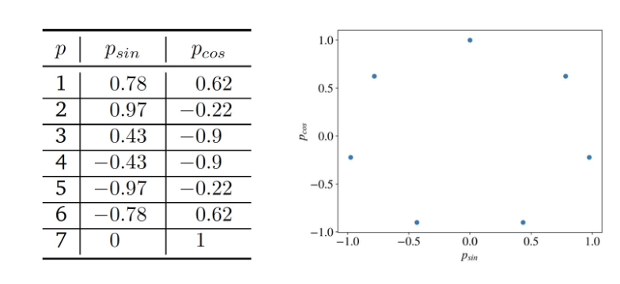

Mean encoding, aka **bin counting** or **feature calibration** is another technique for converting categorical features to numbers, like [One-Hot Encoding](/machine-learning-foundations/feature-engineering/one-hot-encoding).

1. First, the sample mean of the label is calculated using all examples where the feature has value z. 
2. Each value z of the categorical feature is then replaced by that sample mean value.

The advantage of this technique is that the data dimensionality doesn't increase, and, by design, the numerical value contains some information about the label.

If you work on a **binary classification problem**, in addition to sample mean, you can use other useful quantities: the raw counts of the positive class for a given value of z, the **odds ratio**, and the **log-odds ratio**. 

### Integer to sine-cosine transformation for cyclical features, e.g. **week days**

$$
p_{\sin} = \sin\left(\frac{2 \times \pi \times p}{\max(p)}\right), \quad p_{\cos} = \cos\left(\frac{2 \times \pi \times p}{\max(p)}\right)
$$
Encoding day P with Psin/cos increases dimensionality but captures the cyclical meaning of week days.