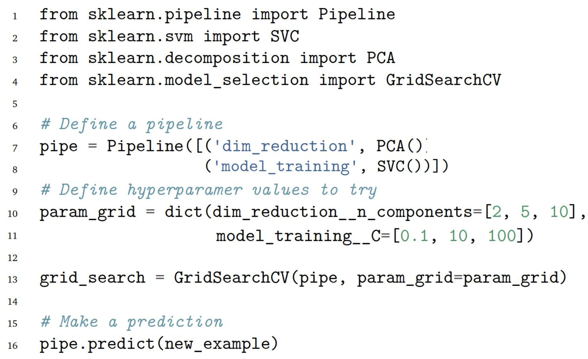

Simplest [Hypterparameter Tuning](/machine-learning-foundations/hyperparameters/hypterparameter-tuning) technique, used with a few hyperparameters and short value ranges.

It discretizes and then evaluates each pair of hyperparameters.

## Evaluation Criteria
- Configuring a pipeline with a pair of hyperparameter values.
- Applying the pipeline to the training data and training a model.
- Computing the performance metric for the model on the validation data.

We train the final model with the best pair of hyperparameter values.

## Example Pipeline

- We try pair value combinations of `PCA n_components[2,5,10]` and `SVM C[0.1,10,100]`
- Guarantees to find the best combination of values.
- Combinatorial explosion for large datasets.
- We need more computationally efficient but less precise techniques.