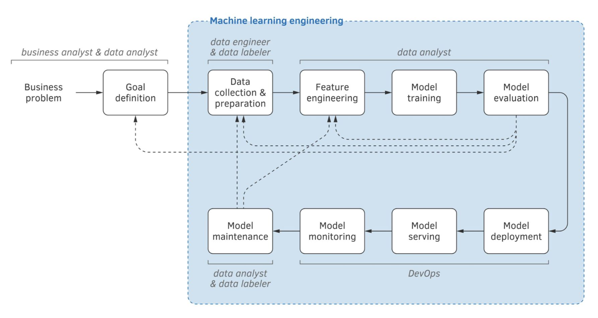

How to design and implement ML algorithms as opposed to model the mathematical properties of those algorithms.

Focus on issues concerning the design and implementation of
- Datasets
- Classes of ML algorithms that use those datasets
- Deployment of those algorithms

Engineering of ML includes
- Understanding requirements
- Collecting and curating datasets
- Pros and cons of each class of algorithms
- Deployment in production with a given environment and budget.

MLE includes any activity that lets machine learning algorithms be implemented as a **part of an effective production system**.

ML engeneers might **rewrite and scale** a data analyst's code, **packaging** the code into an easy-to-deploy versioned package, **optimizing** the machine learning algorithm to make sure that it generates a model compatible with, and running correctly in, the organization's **production environment**.

Data analysts may execute some of the MLE tasks, such as data collection, transformation, and [Feature Engineering](/machine-learning-foundations/feature-engineering/feature-engineering).

ML engineers often execute some of the data analysis tasks, including
- Selection of the learning algorithm
- [Hyperparameter](/machine-learning-foundations/introduction/parameters-and-hyperparameters) tuning
- Model evaluation.

### Goal
Given a customer with a set of requirements understand whether and how a specific ML algorithm will effectively and efficiently satisfy those requirements.
- Should we use ml? [When to (not) Use ML](/machine-learning-foundations/introduction/when-to-not-use-ml)
- Will ML deliver the expected value? [ML Impact](/machine-learning-foundations/introduction/ml-impact)
- What engineering process will be needed?
- How much will it cost to maintain? [ML Cost](/machine-learning-foundations/introduction/ml-cost)

