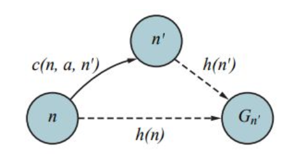

- Best-first search, but expanding the node with lowest h(n)
	- f(n) = h(n)
- What happens if heuristic is bad?
	- Worse-performing algorithm
	- It still will give us the right answer
- What happens if the heuristic is good?
	- Faster convergence toward the goal

**Search Contours**
