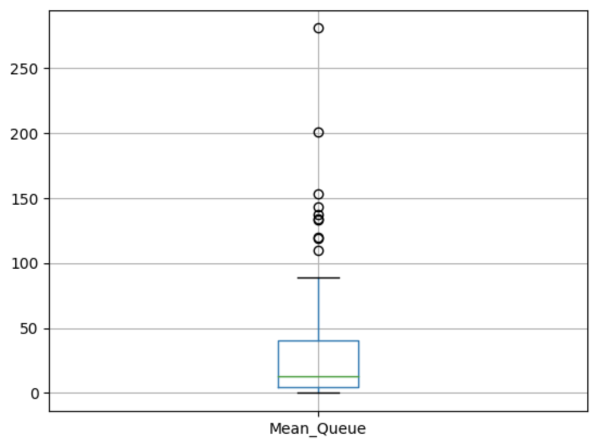

## `SimPy`: Containers
So far, we have considered resources as being **discrete identifiable entities**. But what if our resource was **continuous**, or if we wanted to model a homogeneous mass of resource. For example, imagine that we are modeling the fueling of a car, and our resource was petrol.

Or, maybe rather than model number of nurses, we want to model simultaneous nurse time in use, from which we take from and add back to a pool of time as incoming activity fluctuates.

In SimPy, rather than use the **Resource** class, we can use the **Container** class for this kind of problems. Let's see an example.

```python
import simpy

import random

from statistics import mean

import csv

import pandas as pd

  

def patient_generator_dn(env, dn_inter, mean_visit, district_nurse):

  

while True:

p = activity_generator_dn(env,mean_visit,district_nurse)

env.process(p)

t = random.expovariate(1/dn_inter)

  

yield env.timeout(t)
```

```python
def activity_generator_dn(env, mean_visit, district_nurse):

global queuing_times_dn_list

  

time_entered_queue_dn = env.now

  

# Instead of using the request method, for containers we will just take the

# quantity from the resource given a pseudo-random number

dn_mins_sampled = random.expovariate(1/mean_visit)

print("DN mins available before request:", district_nurse.level)

  

# When we want to take som quantity from the container, we can use the get()

# method of the Container class, passing the number of unit of the resource

# we are taking. We also use the yield keyword so the queue will start

# when we are out of resources in the container.

yield district_nurse.get(dn_mins_sampled)

print("DN mins available after request:", district_nurse.level)

  

time_left_queue_dn = env.now

time_in_queue_dn = time_left_queue_dn - time_entered_queue_dn

queuing_times_dn_list.append(time_in_queue_dn)

  

# Here we can obtain the length of the visit. Obviously it is the same as the

# amount of resource we have taken from the contaier in this case.

yield env.timeout(dn_mins_sampled)

  

# Once the visit duration has elapsed, we will be back here in the function.

# SO we can now put back the minutes into the container using the put()

# method of the container class, again with the yield keyword

yield district_nurse.put(dn_mins_sampled)
```

```python
# Set up number of replicas of the simulation and a seed

n_runs = 100

random.seed(2023)

  

# Create a file to store the results of each run and write the header

with open("dn_nurse_results.csv", "w") as f:

writer = csv.writer(f, delimiter = ",")

writer.writerow(["Run", "Mean_Queue"])

  

for run in range(n_runs):

# Set up the simulation enviroment

env = simpy.Environment()

  

# Set up resources. In this case it is a container. The initial level of the

# container and the maximum capacity will be specified. In this experiment

# makes sense to keep these the same, but in some cases we will need a

# maximum greater than the initial capacity.

district_nurse = simpy.Container(env, init = 1000, capacity = 1000)

  

# Set up parameters

dn_inter = 10

mean_visit = 60

# Create the empty list in the global environment

queuing_times_dn_list = []

# Start the arrivals generators, in this case we have two.

env.process(patient_generator_dn(env, dn_inter, mean_visit, district_nurse))

# Run the simulation

env.run(until=2000)

# Results

mean_queue = mean(queuing_times_dn_list)

# Set up list to write to file in this run

list_to_write = [run, mean_queue]

# Store the results of this run in the file

with open("dn_nurse_results.csv", "a") as f:

writer = csv.writer(f, delimiter = ",")

writer.writerow(list_to_write)
```

```python
results_df = pd.read_csv("dn_nurse_results.csv")

average_mean_runs = results_df["Mean_Queue"].mean()

print("The average waiting time along all the replicas of the experiment is of", average_mean_runs, "minutes")

#Returns The average waiting time along all the replicas of the experiment is of 33.58504766342208 minutes
```

```python
import matplotlib.pyplot as plt

results_df.boxplot("Mean_Queue")

plt.show()
```
