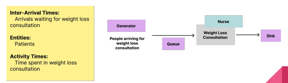
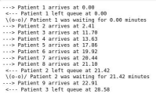

## `SimPy`: Generator Functions

**Conventional** functions in Python are called, and then run with some (optional) inputs, and then finish (usually by returning some output).

**Generator** functions remember where they were and what they did when control is passed back (they retain their "local state"), so that they can continue where they left off, and can be used as powerful iterators (for and while loops are other examples of iterators).

This is very useful when we want a specific state to be maintained (e.g. during a simulation run). Let's look at a very simple example of a generator function to see how they work compared to a normal function:

**Normal Function**
```python
#Normal Function
def conventional_counter():

count = 0

while True: # keep doing this indefinitely

count += 1 # add 1 to the count

return count

# the return keyword will exit the function returning that value

  

a = conventional_counter()

print(a)

a = conventional_counter()

print(a)

a = conventional_counter()

print(a)

a = conventional_counter()

print(a)

# Returns 1 1 1 1
```

**Generator Function**
```python
# Generator Function

def counter_generator():

count = 0

while True: # keep doing this indefinitely

count += 1 # add 1 to the count

yield count

# On the other hand, yield statement identifies this as a generator function.

# Yield is like a return, but it tells the generator function to freeze

# in place and remember where it was ready for the next time it's called

  

my_generator = counter_generator()

  

print(next(my_generator))

print(next(my_generator))

print(next(my_generator))

print(next(my_generator))

#Returns 1 2 3 4
```

## `SimPy`: Applying a Generator
Let's take a look at a very simple example of a DES to learn how to use generators within discrete event simulations. The following graph describes a very simple experiment in which we simulate the queue of patients arriving at a weight loss clinic. We will have inter-arrival times of consultations, the entities as patients, and the activity times will be represented by the consultation time of the patients with the nurse.


### Patient generator
```python
import simpy

import random

  

# Arrivals generator function

def patient_generator(env, wl_inter, mean_consult, nurse):

patient_id = 1

  

# keep generating indefinitely

while True:

# Create instance of activity generator

wp = activity_generator(env,mean_consult,nurse,patient_id)

  

# run the activity generator for this patient

env.process(wp)

  

# Sample time until next patient

t = random.expovariate(1/wl_inter)

# Freeze until that time has passed

yield env.timeout(t)

patient_id += 1
```

### Activity generator
```python
# Activity generator function. This activity generator function normally

# describes arrivals journey

def activity_generator(env, mean_consult, nurse, patient_id):

time_entered_queue = env.now

print ("---> Patient %s arrives at %.2f" % (patient_id, time_entered_queue))

  

# request a nurse from the Resources

with nurse.request() as req:

# Freeze until the request can be met

yield req

  

# Calculate time patient was queuing

time_left_queue = env.now

print (" <--- Patient %s left queue at %.2f" % (patient_id, time_left_queue))

  

time_in_queue = time_left_queue - time_entered_queue

print (" \\(o-o)/ Patient %s was waiting for %.2f minutes" % (patient_id, time_left_queue))

  

# Sample time spent with nurse

consultation_time = random.expovariate(1/mean_consult)

  

# Freeze until that time has passed

yield env.timeout(consultation_time)
```

### Running the simulation
```python
random.seed(2023)

# Set up the simulation enviroment

env = simpy.Environment()

  

# Set up resources

nurse = simpy.Resource(env, capacity = 1)

  

# Set up parameters

wl_inter = 5

mean_consult = 6

  

# Start the arrivals generator

env.process(patient_generator(env,wl_inter, mean_consult, nurse))

  

# Run the simulation

env.run(until=120)
```


## `SimPy`: Multiple Generators

It's possible that we have more than one way for our arrivals to enter our system in the designed model. They may or may not go through the same processes.

For example, patients might arrive at the Hospital by self-presenting or by ambulance, but the same things might happen to them regardless.

It is easy to capture multiple entry points in our systems using SimPy, we just need to set up more than one entity generator.

**Generator 1**
```python
import simpy

import random

# This will be one generator function for the arrival of patients to our

# weight loss clinic for a consultation

def patient_generator_weight_loss(env, wl_inter, mean_consult, nurse):
while True:

wp = activity_generator_weight_loss(env,mean_consult,nurse)

env.process(wp)

t = random.expovariate(1/wl_inter)

  

yield env.timeout(t)
```

**Generator 2**
```python
# This will be a second generator function for the arrivals to the clinic

# for completing a test. We will have different inter-arrival times and can pass

# different activity times.

def patient_generator_test(env, t_inter, mean_test, nurse):

  

while True:

tp = activity_generator_test(env,mean_consult,nurse)

env.process(tp)

t = random.expovariate(1/t_inter)

  

yield env.timeout(t)
```

**Activity Generator 1**
```python
# We have to define one activity generator (trajectory) for each type

# of patient.

def activity_generator_weight_loss(env, mean_consult, nurse):

global queuing_times_nurse_list

time_entered_queue = env.now

  

with nurse.request() as req:

yield req

  

time_left_queue = env.now

time_in_queue = time_left_queue - time_entered_queue

queuing_times_nurse_list.append(time_in_queue)

  

consultation_time = random.expovariate(1/mean_consult)

yield env.timeout(consultation_time)
```

**Activity Generator 2**
```python
# We will also need a new activity generator. In this case we are adding the

# waiting times to the same list for both generators, but we can split it or

# even create a complete different activity for this group of arrivals.

def activity_generator_test(env, mean_test, nurse):

global queuing_times_nurse_list

time_entered_queue_t = env.now

  

with nurse.request() as req:

yield req

  

time_left_queue_t = env.now

time_in_queue_t = time_left_queue_t - time_entered_queue_t

queuing_times_nurse_list.append(time_in_queue_t)

  

consultation_time = random.expovariate(1/mean_test)

yield env.timeout(consultation_time)
```

**Running the simulation**
```python
random.seed(2023)

# Set up the simulation enviroment

env = simpy.Environment()

# Set up resources

nurse = simpy.Resource(env, capacity = 1)

# Set up parameters

wl_inter = 8

t_inter = 10

mean_consult = 10

mean_test = 3

# Create the empty list in the global environment

queuing_times_nurse_list = []

  

# Start the arrivals generators, in this case we have two.

env.process(patient_generator_weight_loss(env,wl_inter, mean_consult, nurse))

env.process(patient_generator_test(env,t_inter, mean_test, nurse))

  

# Run the simulation

env.run(until=120)

# Results

print("the average time in the queue is of", np.array(queuing_times_nurse_list).mean(), "minutes")

# Returns the average time in the queue is of 43.2346811732747 minutes
```
