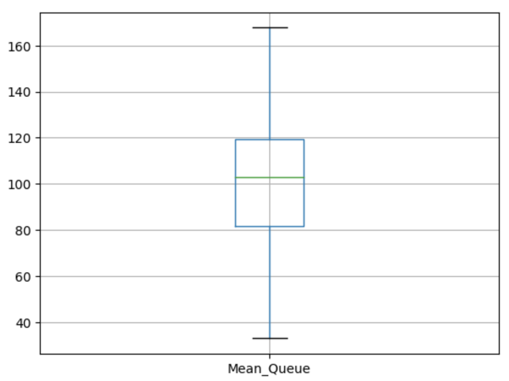

## `SimPy`: Warmup
A potential problem in our DES models is that, by default, we assume that the system is empty of entities (e.g. patients) when the system starts. But sometimes we have to work with systems that are **never empty** (e.g. Emergency Department of a Hospital), and so if we run our model starting from empty, then our results are going to be skewed by the fact that early on in the simulation, there were no or very few people.

Fortunately, there is a simple solution, we can use a **warm up period**. During a warm up period, our model runs, but it doesn't collect any results. The warm-up period allows the simulation to get to a more representative state before we start collecting results.

The **length** of this period will **vary** depending on the system we want to model. We might choose to just set a sufficiently lengthy warm up period to ensure the system is more representative once results start to be taken, or we might run the simulation multiple times and track the results over time to see when a steadier state appears to be reached.

Either way, we can easily add a warm up period to our SimPy models by simply using **conditional statements** to ensure that results are not collected until the simulation time has passed the warm up period. Let's see an example.

```python
def activity_generator_weight_loss(env, mean_consult, nurse):

global queuing_times_nurse_list

time_entered_queue = env.now

  

with nurse.request() as req:

yield req

  

time_left_queue = env.now

time_in_queue = time_left_queue - time_entered_queue

  

# Only add the results after the warm up period

if env.now > warm_up_period:

queuing_times_nurse_list.append(time_in_queue)

  

consultation_time = random.expovariate(1/mean_consult)

yield env.timeout(consultation_time)
```

```python
def activity_generator_test(env, mean_test, nurse):

global queuing_times_nurse_list

time_entered_queue_t = env.now

  

with nurse.request() as req:

yield req

  

time_left_queue_t = env.now

time_in_queue_t = time_left_queue_t - time_entered_queue_t

  

# Only add the results after the warm up period

if env.now > warm_up_period:

queuing_times_nurse_list.append(time_in_queue_t)

  

consultation_time = random.expovariate(1/mean_test)

yield env.timeout(consultation_time)
```

```python
# Set up number of replicas of the simulation and a seed

n_runs = 100

random.seed(2023)

# Specify the results and the warm up periods

# We have to also modify the activities generators only recording

# results after the warm up period.

results_collection_period = 120

warm_up_period = 120

  

# Create a file to store the results of each run and write the header

with open("nurse_results_warm_up.csv", "w") as f:

writer = csv.writer(f, delimiter = ",")

writer.writerow(["Run", "Mean_Queue"])

for run in range(n_runs):

# Set up the simulation enviroment

env = simpy.Environment()

# Set up resources

nurse = simpy.Resource(env, capacity = 1)

# Set up parameters

wl_inter = 8

t_inter = 10

mean_consult = 10

mean_test = 3

# Create the empty list in the global environment

queuing_times_nurse_list = []

# Start the arrivals generators, in this case we have two.

env.process(patient_generator_weight_loss(env,wl_inter, mean_consult, nurse))

env.process(patient_generator_test(env,t_inter, mean_test, nurse))

# Run the simulation

env.run(until=240)

# Results

mean_queue = mean(queuing_times_nurse_list)

# Set up list to write to file in this run

list_to_write = [run, mean_queue]

# Store the results of this run in the file

with open("nurse_results_warm_up.csv", "a") as f:

writer = csv.writer(f, delimiter = ",")

writer.writerow(list_to_write)
```

```python
results_df = pd.read_csv("nurse_results_warm_up.csv")

average_mean_runs = results_df["Mean_Queue"].mean()

print("The average waiting time along all the replicas of the experiment is of", average_mean_runs, "minutes")

#Returns The average waiting time along all the replicas of the experiment is of 99.96355957462922 minutes
```

```python
import matplotlib.pyplot as plt

results_df.boxplot("Mean_Queue")

plt.show()
```


